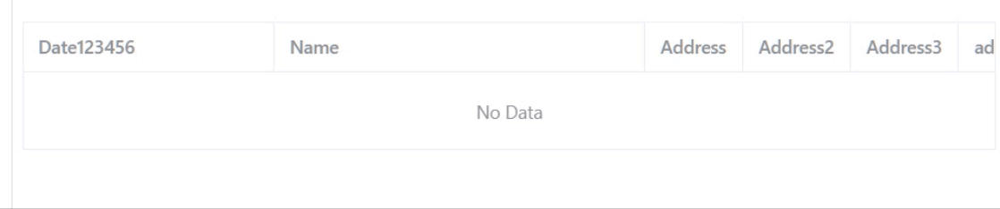

# 修正 el-table 在 layout 为 auto 時，會有 resize 的 bug



## 問題描述

如 [Playground](https://element-plus.run/#eyJzcmMvQXBwLnZ1ZSI6Ijx0ZW1wbGF0ZT5cbiAgPGgyPnRhYmxlLWxheW91dCDoqK3ngrogYXV0byDmmYLvvIzlr6zluqboi6XmnInlsI/mlbjpu57vvIzmnIPpgKDmiJAgcmVzaXplIOeVsOW4uDwvaDI+XG4gIDxoMz7mraPluLg8L2gzPlxuICA8ZWwtdGFibGUgYm9yZGVyIHN0eWxlPVwid2lkdGg6IDEwMCVcIiB0YWJsZS1sYXlvdXQ9XCJhdXRvXCI+XG4gICAgPGVsLXRhYmxlLWNvbHVtbiBwcm9wPVwiZGF0ZVwiIGxhYmVsPVwiRGF0ZVwiIHdpZHRoPVwiMjAwXCIgLz5cbiAgICA8ZWwtdGFibGUtY29sdW1uIHByb3A9XCJuYW1lXCIgbGFiZWw9XCJOYW1lXCIgd2lkdGg9XCIzMDBcIiAvPlxuICAgIDxlbC10YWJsZS1jb2x1bW4gcHJvcD1cImFkZHJlc3NcIiBsYWJlbD1cIkFkZHJlc3NcIiAvPlxuICA8L2VsLXRhYmxlPlxuICA8aDM+5Zau5pOK6YKK5qGG5pyD5pyJ5L2N56e75oOF5rOBPC9oMz5cbiAgPGVsLXRhYmxlIGJvcmRlciBzdHlsZT1cIndpZHRoOiAxMDAlXCIgdGFibGUtbGF5b3V0PVwiYXV0b1wiPlxuICAgIDxlbC10YWJsZS1jb2x1bW4gcHJvcD1cImRhdGVcIiBsYWJlbD1cIkRhdGUxMjM0NTZcIiB3aWR0aD1cIjIwMFwiIC8+XG4gICAgPGVsLXRhYmxlLWNvbHVtbiBwcm9wPVwibmFtZVwiIGxhYmVsPVwiTmFtZVwiIHdpZHRoPVwiMzAwXCIgLz5cbiAgICA8ZWwtdGFibGUtY29sdW1uIHByb3A9XCJhZGRyZXNzXCIgbGFiZWw9XCJBZGRyZXNzXCIgd2lkdGg9XCI3NVwiIC8+XG4gICAgPGVsLXRhYmxlLWNvbHVtbiBwcm9wPVwiYWRkcmVzczJcIiBsYWJlbD1cIkFkZHJlc3MyXCIgd2lkdGg9XCI3NVwiIC8+XG4gICAgPGVsLXRhYmxlLWNvbHVtbiBwcm9wPVwiYWRkcmVzczNcIiBsYWJlbD1cIkFkZHJlc3MzXCIgd2lkdGg9XCI3NVwiIC8+XG4gICAgPGVsLXRhYmxlLWNvbHVtbiBwcm9wPVwiYWRkcmVzczRcIiBsYWJlbD1cImFkZHJlc3M0XCIgLz5cbiAgPC9lbC10YWJsZT5cbjwvdGVtcGxhdGU+XG5cbjxzY3JpcHQgbGFuZz1cInRzXCIgc2V0dXA+XG5cbjwvc2NyaXB0PlxuIiwiaW1wb3J0LW1hcC5qc29uIjoie1xuICBcImltcG9ydHNcIjoge31cbn0iLCJ0c2NvbmZpZy5qc29uIjoie1xuICBcImNvbXBpbGVyT3B0aW9uc1wiOiB7XG4gICAgXCJ0YXJnZXRcIjogXCJFU05leHRcIixcbiAgICBcImpzeFwiOiBcInByZXNlcnZlXCIsXG4gICAgXCJtb2R1bGVcIjogXCJFU05leHRcIixcbiAgICBcIm1vZHVsZVJlc29sdXRpb25cIjogXCJCdW5kbGVyXCIsXG4gICAgXCJ0eXBlc1wiOiBbXCJlbGVtZW50LXBsdXMvZ2xvYmFsLmQudHNcIl0sXG4gICAgXCJhbGxvd0ltcG9ydGluZ1RzRXh0ZW5zaW9uc1wiOiB0cnVlLFxuICAgIFwiYWxsb3dKc1wiOiB0cnVlLFxuICAgIFwiY2hlY2tKc1wiOiB0cnVlXG4gIH0sXG4gIFwidnVlQ29tcGlsZXJPcHRpb25zXCI6IHtcbiAgICBcInRhcmdldFwiOiAzLjNcbiAgfVxufVxuIiwiX28iOnt9fQ==) 所示，單擊下面的表格的邊框會有位移的情況發生，造成後續的操作困難。

推測是 table 在 layout 为 auto ，且 table 內容超出容器的寬度時，造成[布局算法](https://developer.mozilla.org/zh-CN/docs/Web/CSS/table-layout#auto)的結果讓寬度有小數點，進而造成 resize 的 bug。

## 解決方法

table 的 layout 改為 fixed 即可解決這個問題。

```vue
<el-table border style="width: 100%" table-layout="fixed">
```
