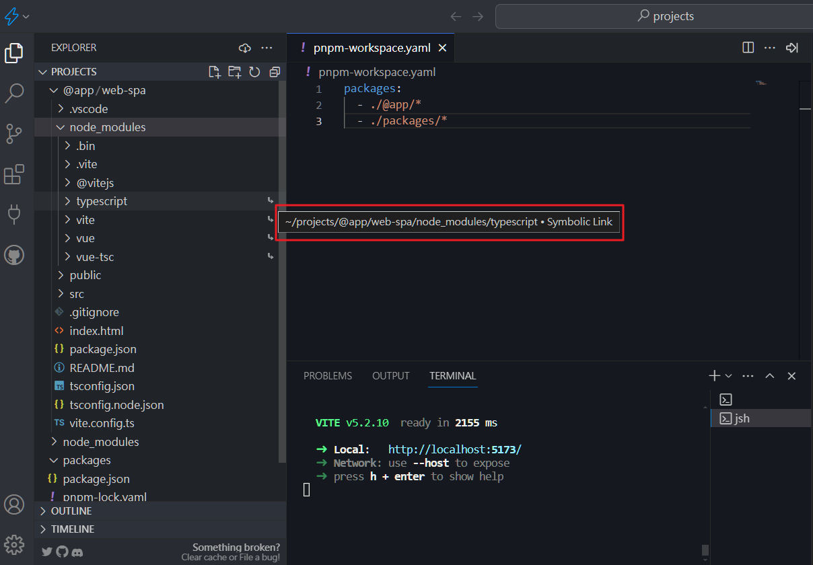

# 使用 pnpm-workspace 建立 monorepo

> pnpm-workspace 是 pnpm 的一個功能，可以讓我們在一個專案中管理多個 package 和 應用程式，也就是 monorepo。

## 建立專案

首先先建立一個空的 package.json

```bash
pnpm init
```

加入 `pnpm-workspace.yaml`，裡面指定 packages 和應用程式的位置

```yaml
packages:
  - ./@app/*
  - ./packages/*
```

新增放 package 和應用程式的資料夾

```bash
mkdir packages
mkdir @app
```

建立一個資料夾來建立第一個專案

```bash
mkdir @app/web-spa
cd @app/web-spa
pnpm create vite .
```

> 這邊是選擇 vite 來建立一個 vue3 的專案，並且使用 Typescript 開發

選擇完成後，按造提示輸入 `pnpm install` 然後 `pnpm dev` 就可以開始開發了:100:

---

### 執行特定的 package

我們新增一個 script 來執行特定的 package

```json
{
  "name": "@hello-web/monorepo",
  "version": "1.0.0",
  "description": "",
  "main": "index.js",
  "scripts": {
    "web-spa":"pnpm --filter web-spa" // [!code focus]
  },
  "keywords": [],
  "author": "",
  "license": "ISC"
}
```

效果上 `pnpm web-spa dev` 跟切換到 @app/web-spa 資料夾下執行 `pnpm dev` 是一樣的

---

:file_folder: 介紹一下目前專案結構

::: details

```sh
.
├── @app
│   └── web-spa # 前端專案
│       ├── node_modules # 軟連結至根目錄的 node_modules # [!code highlight]
│       ├── package.json
│       ├── index.html
│       ├── tsconfig.json
│       ├── tsconfig.node.json
│       ├── vite.config.ts
│       └── src
│           ├── App.vue
│           └── main.ts
├── packages
├── node_modules # 硬連結至 .pnpm-store # [!code highlight]
├── pnpm-lock.yaml #只有根目錄有 # [!code highlight]
├── pnpm-workspace.yaml
└── package.json
```

點開 @app/web-spa 裡面的 node_modules 可以看到都是用 **軟連結(symlinks)** 指向根目錄的 node_modules ，也就是如果有其他的 package 或應用程式也使用到相同的套件，pnpm 會自動幫我們建立軟連結，以節省空間。

> 

還能看到 pnpm-lock.yaml 只有根目錄有，這是因為 pnpm 會自動幫我們管理所有的 package 的版本，所以只需要一個 lock file 就夠了。
::

## 共用的 packages

我們可以建立一些共用的 packages 來放一些共用的設定或是當作 library 來使用

### 建立 typescript-config

在 packages 資料夾下建立 typescript-config 資料夾，再建立一個 package.json

```bash
mkdir packages/typescript-config
cd packages/typescript-config
pnpm init
```

調整一下 package.json 裡面 name 的名稱，會使用 `{@username or @org-name}/package-name` 這樣的格式，因為在 packages 這邊的專案可能會發布到 npm 上，可以避免衝突和知道你 package 的範圍和來源，詳細能看 [stack overflow](https://stackoverflow.com/questions/36667258/what-is-the-meaning-of-the-at-prefix-on-npm-packages) 的說明

```json
{
  "name": "@hello-web/typescript-config", // [!code focus]
  "version": "1.0.0",
  "description": "",
  "main": "index.js",
  "scripts": {
    "test": "echo \"Error: no test specified\" && exit 1"
  },
  "keywords": [],
  "author": "",
  "license": "ISC"
}

```

::: tip
:bulb:@app 通常是用來放應用程式，就不會當作 package 來發布，但是你也可以根據自己的實際需求來命名
:::

接著安裝 typescript

```bash
pnpm add -D typescript
```

安裝好後，可以把我們一開始建立的前端專案的 **tsconfig.json** 和 **tsconfig.node.json** 移過來

**tsconfig.json**

```json
{
  "compilerOptions": {
    "target": "ES2020",
    "useDefineForClassFields": true,
    "module": "ESNext",
    "lib": ["ES2020", "DOM", "DOM.Iterable"],
    "skipLibCheck": true,

    /* Bundler mode */
    "moduleResolution": "bundler",
    "allowImportingTsExtensions": true,
    "resolveJsonModule": true,
    "isolatedModules": true,
    "noEmit": true,
    "jsx": "preserve",

    /* Linting */
    "strict": true,
    "noUnusedLocals": true,
    "noUnusedParameters": true,
    "noFallthroughCasesInSwitch": true
  },
  "include": ["src/**/*.ts", "src/**/*.tsx", "src/**/*.vue"], // [!code --]
  "references": [{ "path": "./tsconfig.node.json" }] // [!code --]
}

```

**tsconfig.node.json**

```json
{
  "compilerOptions": {
    "composite": true,
    "skipLibCheck": true,
    "module": "ESNext",
    "moduleResolution": "bundler",
    "allowSyntheticDefaultImports": true,
    "strict": true
  },
  "include": ["vite.config.ts"] // [!code --]
}

```

> include 和 references 先拿掉，後面會再加上去

---

在前端專案安裝 typescript-config

```bash
pnpm web-spa add -D @hello-web/typescript-config
```

> 安裝完後會在 package.json 裡看到 `"@hello-web/typescript-config": "workspace:^"`，代表版本會跟工作區的 package 連結起來。如果需要其他用法，可以參考[官方文件](https://pnpm.io/workspaces)

我們切換到前端專案後再把剛剛移過去的 **tsconfig.json** 和 **tsconfig.node.json** 新增起來，內容改成
**tsconfig.json**

```json
{
  "extends": "@hello-web/typescript-config/tsconfig.json",
  "include": ["src/**/*.ts", "src/**/*.tsx", "src/**/*.vue"], // [!code ++]
  "references": [{ "path": "./tsconfig.node.json" }] // [!code ++]
}
```

**tsconfig.node.json**

```json
{
  "extends": "@hello-web/typescript-config/tsconfig.node.json",
  "include": ["vite.config.ts"] // [!code ++]
}
```

> 剛剛移掉的 include 和 references 再加回來。
>
> 有其他的 package 或應用程式也需要使用 typescript-config 的設定，只需要安裝這個 package 就可以了，剩下則根據實際專案的需求來新增。

這時在執行一次前端專案，都沒問題那就可以下一步了

### 建立 eslint-config

大部分步驟都跟上面一樣，這邊就不再贅述

```bash
mkdir packages/eslint-config
cd packages/eslint-config
pnpm init
```

**package.json**

```json
{
  "name": "@hello-web/eslint-config",
  "version": "1.0.0",
  "description": "",
  "main": "index.js",
  "scripts": {
    "test": "echo \"Error: no test specified\" && exit 1"
  },
  "keywords": [],
  "author": "",
  "license": "ISC"
}
```

安裝 `@antfu/eslint-config`

```bash
pnpm add -D @antfu/eslint-config

```

> 這是 Anthony Fu 大神的寫的 [eslint config](https://github.com/antfu/eslint-config)，實際用法可以參考大神的文件

新增 **eslint.config.js**

```js
import antfu from '@antfu/eslint-config'

export default antfu()
```

好了之後在根目錄安裝 eslint 和 eslint-config

```bash
pnpm add -Dw eslint @hello-web/eslint-config
```

> 預設是不能安裝 workspace 的 package 的，所以要加上 `-w` 來安裝

根目錄也新增一個 **eslint.config.js**

```js
import config from '@hello-web/eslint-config/eslint.config.js'

export default config
```

package.json 裡面的 script 加上 eslint

```json
{
  "name": "@hello-web/monorepo",
  "version": "1.0.0",
  "description": "",
  "main": "index.js",
  "scripts": {
    "web-spa": "pnpm --filter web-spa",
    "lint": "eslint . --fix" // [!code focus]
  },
  "keywords": [],
  "author": "",
  "license": "ISC",
  "devDependencies": {
    "@hello-web/eslint-config": "workspace:^",
    "eslint": "^9.1.1"
  }
}

```

接著執行 `pnpm lint` 就可以看到 eslint 的結果了

```bash
pnpm lint
```

::: warning
如果出現這個錯誤`Warning: To load an ES module, set "type": "module" in the package.json or use the .mjs extension.` 要在兩邊的 package.json 裡面加上 `"type": "module"`，這是因為這邊 eslint 用的是 ES module 的方式來寫的
:::

如果成功可以再下一步囉

### 建立 tailwind-config

### 建立 ui-library

### 建立 nuxt專案

### 建立 vitepress 應用

### 建立 storybook
